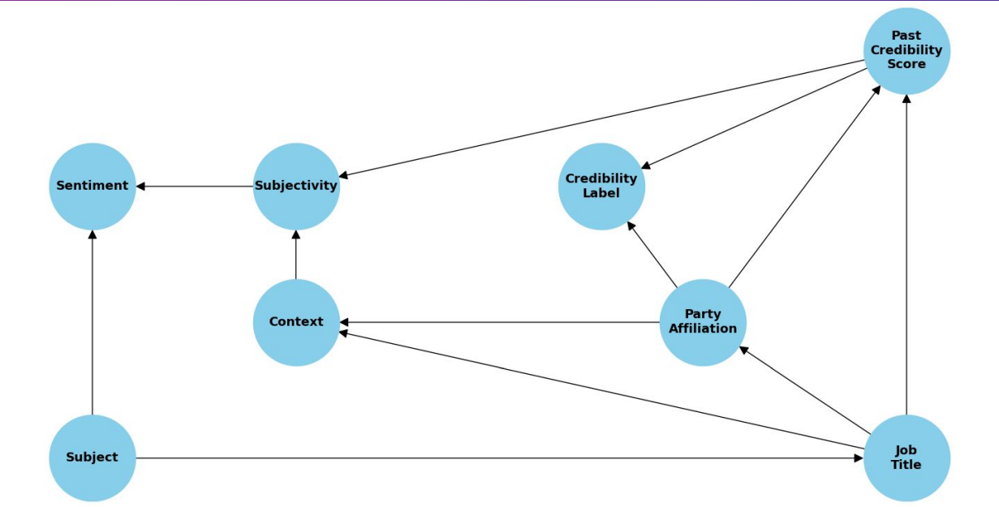

# Bayesian Network for News Credibility Assessment

  

This repository contains the Python and Netica implementation for a Bayesian Network project which evaluates the credibility of news statements. The project leverages the LIAR dataset to analyze and predict the credibility based on various features like the speaker's job title, party affiliation, and the context of the statement.

## Table of Contents
- [Project Overview](#project-overview)
- [Dataset](#dataset)
- [Preprocessing](#preprocessing)
- [Bayesian Network Model](#bayesian-network-model)
- [Netica Implementation](#netica-implementation)
- [Getting Started](#getting-started)
- [Usage](#usage)
- [Future Work](#future-work)
- [Contributing](#contributing)
- [License](#license)
- [Acknowledgements](#acknowledgements)

## Project Overview
This project aims to address the research question: What indicators most significantly determine the credibility of news statements? Using a Bayesian Network, it captures the probabilistic relationships among different features that influence news credibility.

## Dataset
The LIAR dataset is utilized for this project, which includes 12.8k manually labeled short statements along with metadata such as the speaker's job title, subject, context, and party affiliation.

## Preprocessing
The Jupyter notebook `main.ipynb` contains the data preprocessing steps which include:
- Calculation of credibility score
- Categorization of party affiliation and speaker's job title
- Sentiment and subjectivity analysis
- Removal of irrelevant columns and handling missing values

## Bayesian Network Model
The Bayesian Network is constructed based on the relevant nodes identified from the dataset. These nodes include Job Title, Party Affiliation, Subject, Context, Subjectivity, Sentiment, Past Credibility Score, and Credibility Label. The relationships between these nodes are determined through a hill-climbing search algorithm and evaluated using the Akaike Information Criterion (AIC) score.

## Netica Implementation
After saving the model as .net, GeNIe was used to convert it into .dne as Netica supports .dne network files and then Netica was used to open the network and visualize and work with it. 

## Usecase Example
How past credibility score of a speaker influences the probability of credibility label of the current statement?

  

  

## Future Work
The project outlines several future steps to improve the model, including updating node states, trying different algorithms, researching other relevant features, and model validation.

